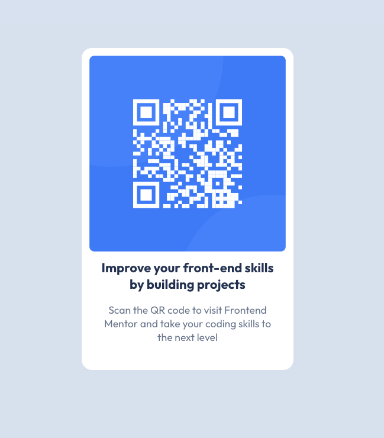

# Frontend Mentor - QR code component solution

This is a solution to the [QR code component challenge on Frontend Mentor](https://www.frontendmentor.io/challenges/qr-code-component-iux_sIO_H). Frontend Mentor challenges help you improve your coding skills by building realistic projects.

## Table of contents

- [Overview](#overview)
  - [Screenshot](#screenshot)
  - [Links](#links)
- [My process](#my-process)
  - [Built with](#built-with)
  - [What I learned](#what-i-learned)
  - [Continued development](#continued-development)
  - [Useful resources](#useful-resources)

## Overview

### Screenshot

### Links

- Solution URL: https://github.com/Saekit/FM-QR-Code
- Live Site URL: https://saekit.github.io/FM-QR-Code/

## My process

### Built with

- Semantic HTML5 markup
- CSS custom properties
- Flexbox
- CSS Grid
- Mobile-first workflow
- [React](https://reactjs.org/) - JS library
- [Vite](https://vitejs.dev/) - React framework

### What I learned

This is the first React project I have worked on in almost a year. Working on this small project has helped me refresh my frontend skills using React and CSS. I learned how to spin up a Vite project and then publish it live using Github Pages.

### Continued development

I would like to use more tools within React, like styled components, typescript, and more.

### Useful resources

- [Github Community Discussions](https://github.com/orgs/community/discussions/61478) - This helped me solve the issue I was having when trying to deploy my project to Github Pages.
